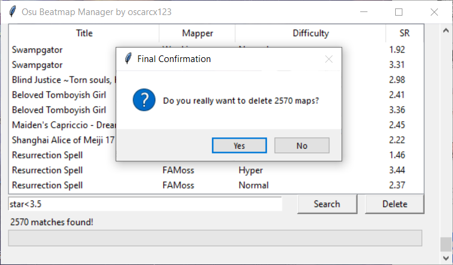

# Osu! Beatmap Manager

[中文点这里](./README_zh-cn.md)

An Easy way to delete unwanted beatmaps.

## How to use

Run `beatmap.py`, then just search like you do in osu! All deleted files will go to recycle bin.

## Other Tools

[TcNo-osu-Cleaner](https://github.com/TcNobo/TcNo-osu-Cleaner) will take care of all the unnecessary files. Highly recommended!