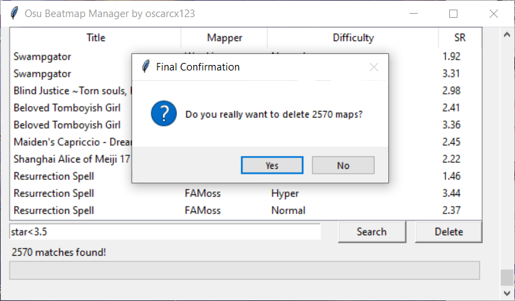

# Osu! Beatmap Manager

[English Version here...](./README.md)

这个工具可以帮你轻松删图~

## 使用方法

运行`beatmap.py`，然后跟osu一样直接搜索即可。所有删除的图都会被扔到回收站。

## 其它工具

[TcNo-osu-Cleaner](https://github.com/TcNobo/TcNo-osu-Cleaner)能删一些乱七八糟占地方的文件（比如视频、皮肤等），个人用了感觉还不错。